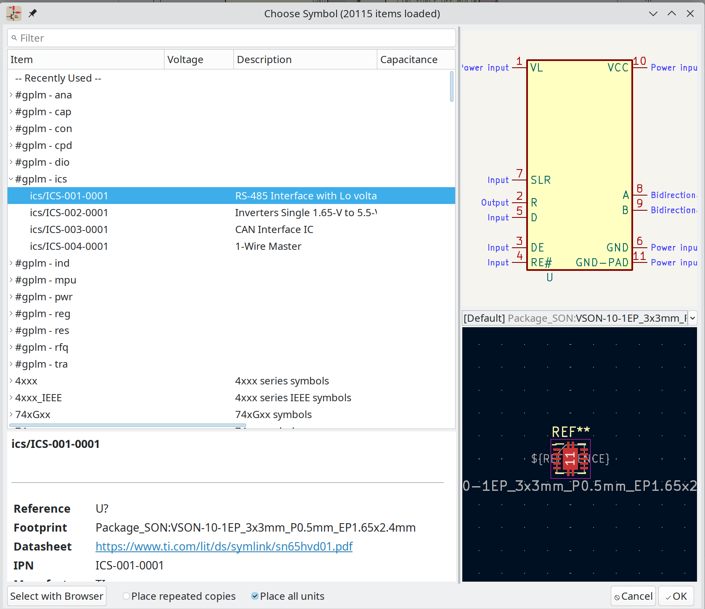

# GitPLM Parts Project

**Maintaining eCAD parts libraries is a lot of work. Are you:**

- tired of the tedious work of maintaining tradition KiCad libraries or manually
  adding MFG information to each part in a design?
- duplicating symbols in KiCad just because a parameter needs changed?
- duplicating information in your parts database and in schematic symbols?
- duplicating a lot of work in each design and occasionally make mistakes like
  specifying the wrong MPN?
- afraid of of the complexity of setting up a database for KiCad libraries?
- having trouble tracking who made what changes made in a parts database?
- struggling to find a CAD library process that will scale to large teams?

**The GitPLM Parts project is a collection of best practices that allows you
to:**

1. easily set to a database driven parts libraries without a central database
   and connection (Git friendly).
2. leverage a common library of parts across multiple designs.
3. easily specify part parameters in table format.
4. not duplicate part parameters.
5. leverage the standard KiCad symbol library for most common parts.
6. easy add variants with just a line in a CSV file.
7. track all database changes.
8. scale to multiple designers.

## Demo

See a demonstration of this library in use at:

- [](https://youtu.be/uXw8gY1IN_A)

## Using the GitPLM Parts Database in KiCad

Give it a try -- it will only take a few minutes.

- clone this repo: `git clone https://github.com/git-plm/parts.git`
- clone the 3d models repo: `git clone https://github.com/git-plm/3d-models.git`
- In KiCad Preferences->Configure Paths:
  - set `GITPLM_PARTS` to the location of the parts repo
  - set `'GITPLM_3DMODELS` to the location of the 3d-models repo
- install the following packages: `sqlite3 unixodbc libsqliteodbc sqlitebrowser`
- make sure `/etc/odbcinst.ini` contains a
  [SQLite3 section](https://wiki.archlinux.org/title/Open_Database_Connectivity#SQLite)
- In KiCad Preferences->Manage Symbol Libraries:
  - add the `#gplm.kicad_dbl`. This filename is prefixed with `#` so that it
    shows up at the top of the list in the schematic symbol chooser.
  - add all `g-*.kicad_sym` libraries
- In KiCad Preferences->Manage Footprint Libraries:
  - add all `g-*.pretty` directories

(above tested on Arch Linux, so the bits about SQLite3 libs may vary slightly on
other platforms). Also tested on Ubuntu 23.04, use the same instructions as for
Arch Linux (apt install sqlite3 unixodbc etc...)

Then when you open the symbol chooser, you will see something like:



Notes, the #gplm entries are at the top where they are quick to get to.

Right-clicking on the column headings in the chooser allows you to specify which
parameters are displayed.

## Update/Generate the database

The following is tested on Linux but should work in any Linux-like command-line
environment.

- edit `csv` files
- if you are adding a new part category, create a new `csv` file, then edit
  `envsetup.sh` to add to the list of imports.
- `. envsetup.sh` (notice the leading `.` -- this is equivalent to the `source`
  command)
- run the `parts_db_create` command
  - this deletes `parts.sqlite` and regenerates it
- `sqlitebrowser` can be used to view/verify the database. Don't edit the
  database as it is overwritten on each import.
- **restart KiCad** (yes the entire application). This seems to be the only way
  to get KiCad to reload the database changes. (if anyone knows of a better way,
  please let us know!)

## Debugging broken \*.kicad_dbl files

Sometimes when you modify the `#gplm.kicad_dbl` file, there is a typo and KiCad
will no longer load it and does not give you any helpful debugging messages. You
can use the [jq](https://github.com/jqlang/jq) command line utility to quickly
find errors in the file, since the `kicad_dbl` format appears to be JSON.

`jq . \#gplm.kicad_dbl`

## Adding New Parts

If the symbol and footprint already exist, adding a new part is as simple as:

1. add a line to one of the `csv` files. The `csv` files should be sorted by
   `IPN`. This ensures the `IPN` is unique (which is the lib/db key), and merge
   operations are simpler if the file is always sorted.
2. run `parts_db_create`
3. restart KiCad

If you need to add a symbol or footprint, add to the matching `g-XXX.kicad_sym`,
or `g-XXX.pretty` libraries. Standards in the
[KiCad KLC](https://klc.kicad.org/) should be followed as much as possible.
Specific requirements:

1. set symbol outline to 10mil
2. fill symbol with background color (light yellow)
3. active low pins should be designated using a bar. This is done with the
   following pin name syntax: `~{PIN_NAME}`
4. symbol pin lengths
   - \< 10 pins: 100mil
   - 10 - 99 pins: 150mil
   - \> 100 pins: 200mil

NOTE: To aid in the accurate connection of wires in EESCHEMA symbol pins,
regardless of their pin lengths, should fall on a 100mil/2.54mm grid. Move the
symbol so its origin falls on the lower leftmost pin of the symbol. Having
consistent symbol origins facilitates moving and updating or replacing symbols
during the editing process and makes ERC checking easier.

For footprints the symbol origin for surface mounted parts should be placed in
the dead center of the part to aid in programming automated assembly machines.
For through hole parts that are not automatically placed usually pin 1 serves as
the origin to simplify dimensioning since components such as connectors often
have placement restrictions necessitated by other features such as openings in
enclosures, mating PCB's, and so on.

The KiCad symbol `Value` field is populated with:

- resistance, capacitance, and inductance for passives. Spice simulations use
  the value field, so it is good to have it populated.
- MPN for most other parts

## Implementation details

This repo contains a parts database designed to work with
[KiCad Database Libraries feature](https://docs.kicad.org/7.0/en/eeschema/eeschema.html#database-libraries).

The IPN (Internal Part Number) format used is specified in
[this document](partnumbers.md).

IPN format: CCC-NNNN-VVVV

- CCC: one to three letters or numbers to identify major category (RES, CAP,
  DIO, E (electrical), M (mechanical), etc).
- NNNN: incrementing sequential number for each part. This gives this format
  flexibility.
- VVVV: use to code variations of similar parts typically with the same
  datasheet or family (resistance, capacitance, regulator voltage, IC package,
  screw type, etc.). VVVV is also used to encode version and variations for
  manufactured parts or assemblies.

The workflow is designed to be _Git Friendly_:

- everything can be checked into Git
- changes can be easily diff'd
- there is no central database that requires network connections, VPNs, etc.
- all changes to the parts database are tracked in Git.

CSV files are a convenient way to store tabular data in Git. Tools like Gitea
and Github are good at
[viewing](https://github.com/git-plm/parts/blob/main/cap.csv) and
[diffing CSV files](https://community.tmpdir.org/uploads/default/original/2X/2/22193b11a07063ab7759edd6b3cd57a25521073f.png).
This allows anyone to edit the database. Complex database permissions are not
required as workflow is managed through standard Git mechanisms like PRs. As an
example, changes from new users may be reviewed before merging to the main
branch.

So we use the following flow:

`CSV -> Sqlite3 -> ODBC -> KiCad`

This might seem overly complex, but it is actually pretty easy as Sqlite3 can
import `csv` files, so no additional tooling is required. See the
[`envsetup.sh`](envsetup.sh) file for how this is done.

`csv` files can be easily edited in [Libreoffice](https://www.libreoffice.org/)
or [VisiData](https://www.visidata.org/).

If you use VisiData on Linux, please set the following option in `~/.visidatarc`
to make the CSV line endings compatible with LibreOffice Calc:

```
options.csv_lineterminator = "\x0a"
```

A separate `csv` file is used for each
[part category](https://github.com/git-plm/gitplm/blob/main/partnumbers.md#three-letter-category-code)
(ex: IND, RES, CAP, etc). There are several reasons for this:

- each part type needs different fields, so this limits the number of columns we
  need in each `csv` file.
- likewise, for each part type, we typically want a different set of fields
  displayed by default in the schematic. The `kicad_dbl` file allows us to
  specify this. For example, with a resistor we want a Resistance field and with
  Capacitors we want a Capacitance field.
- grouping each category into a different library makes it nicer to search for
  parts.

This database is designed to be general purpose and can be used by multiple
projects and companies. Practically, things vary a lot between different
companies so this will likely serve more as an example.

Initially, this part database will be optimized for low-cost rapid prototyping
at places like [JLCPCB](https://jlcpcb.com/) and
[Seeed Studio](https://www.seeedstudio.com/fusion_pcb.html) using parts from:

- https://jlcpcb.com/Parts
- https://www.seeedstudio.com/opl.html

(this may not be work out so the approach may change)

## Status/Support

This library is currently being used successfully in several projects. We
currently do most work in an Internal Gitea repo as the CSV diff functionality
is so much better than Github, but occasionally push updates to this mirror.

For commercial support, training, or design assistance, please contact us at:

- [TMPDIR community](https://community.tmpdir.org/)
- [BEC Systems](https://bec-systems.com/)

## Reference

- https://forum.kicad.info/t/gitplm-parts-kicad-database-ideas/47358
- https://docs.kicad.org/7.0/en/eeschema/eeschema.html#database-libraries
- https://forum.kicad.info/t/kicad-the-case-for-database-driven-design/34621
- https://wiki.archlinux.org/title/Open_Database_Connectivity
