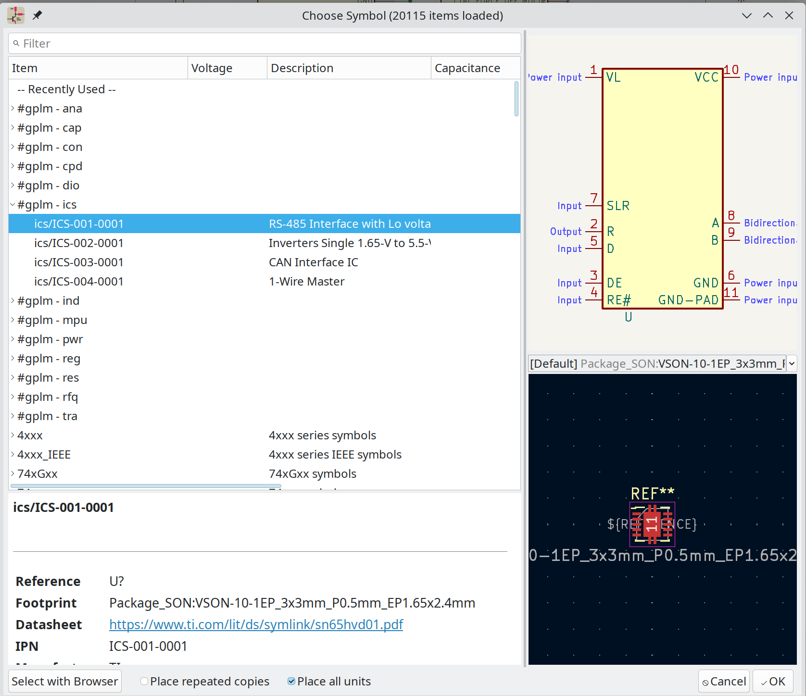

# GitPLM Parts Project

<!--toc:start-->

- [GitPLM Parts Project](#gitplm-parts-project)
  - [Overview](#overview)
  - [Demo Video](#demo-video)
  - [Using the GitPLM Parts Database in KiCad](#using-the-gitplm-parts-database-in-kicad)
  - [Update the parts database](#update-the-parts-database)
  - [Configuring which fields KiCad displays](#configuring-which-fields-kicad-displays)
  - [Database libraries (obsolete)](#database-libraries-obsolete)
  - [Adding New Parts](#adding-new-parts)
  - [Implementation details](#implementation-details)
  - [Directories](#directories)
  - [Status/Support](#statussupport)
  - [Reference](#reference)
  <!--toc:end-->

(See also our [document on partnumber formats](partnumbers.md).)

## Overview

**Maintaining eCAD parts libraries is a lot of work. Are you:**

- Tired of the tedious work of maintaining tradition KiCad libraries or manually
  adding MFG information to each part in a design?
- Duplicating symbols in KiCad just because a parameter needs changed?
- Duplicating information in your parts database and in schematic symbols?
- Duplicating a lot of work in each design and occasionally make mistakes like
  specifying the wrong MPN?
- Afraid of the complexity of setting up a database for KiCad libraries?
- Are you having trouble tracking who made what changes made in a parts
  database?
- Struggling to find a CAD library process that will scale to large teams?

**The GitPLM Parts project is a collection of best practices that allows you
to:**

1. Easily set to a database driven parts libraries without a central database
   and connection (Git friendly).
2. Leverage a common library of parts across multiple designs.
3. Easily specify part parameters in table format.
4. Not duplicate part parameters.
5. Leverage the standard KiCad symbol library for most common parts.
6. Easy add variants with just a line in a CSV file.
7. Track all database changes.
8. Scale to multiple designers.

## Demo Video

Click the image below to see a demonstration of this library in use:

[https://youtu.be/uXw8gY1IN_A](https://youtu.be/uXw8gY1IN_A)

[](https://youtu.be/uXw8gY1IN_A)

## Using the GitPLM Parts Database in KiCad

[GitPLM](https://github.com/git-plm/gitplm) serves this database to KiCad over
the
[KiCad HTTP Libraries feature](https://dev-docs.kicad.org/en/apis-and-binding/http-libraries/).
KiCad reads the parts from a local server that GitPLM runs from the CSV files in
this repo, so there is no database to build and no ODBC driver to install.

Give it a try - it will only take a few minutes.

- Clone this repo: `git clone https://github.com/git-plm/parts.git`
- Clone the 3d models repo: `git clone https://github.com/git-plm/3d-models.git`
- [Install GitPLM](https://github.com/git-plm/gitplm#-installation)
- In KiCad Preferences->Configure Paths:
  - set `GITPLM_PARTS` to the location of the parts repo
  - set `GITPLM_3DMODELS` to the location of the 3d-models repo
- Start the parts server from the root of this repo: `gitplm http`
  - [`gitplm.yml`](gitplm.yml) points the server at the `database` directory and
    configures which part fields KiCad displays
- In KiCad Preferences->Manage Symbol Libraries:
  - Add all the libraries in the `symbols` directory
  - Add the [`database/gplm.kicad_httplib`](database/gplm.kicad_httplib) file,
    which tells KiCad where to find the running server
- In KiCad Preferences->Manage Footprint Libraries:
  - Add all `g-*.pretty` directories in the `footprints` directory

Then when you open the symbol chooser, you will see something like:



Right-clicking on the column headings in the chooser allows you to specify which
parameters are displayed.

The server needs to be running whenever you open a schematic that uses these
parts, so it is worth starting it from a terminal you leave open, your shell
profile, or a systemd user service.

## Update the parts database

- Edit the `csv` files in the `database` directory
- Save. `gitplm http` watches the directory and reloads the CSV files whenever
  one of them changes, printing a message like:

  ```
  Change detected in g-res.csv - reloaded 23 CSV files, 1697 parts
  ```

- That is all. The next time you add a symbol in the schematic, the new data is
  there. There is no database to regenerate and no need to restart KiCad.

A new part category is simply a new `g-CCC.csv` file in the `database`
directory. The server picks it up on the next reload and the category appears in
KiCad.

`csv` files can be edited in a text editor, in
[LibreOffice](https://www.libreoffice.org/), in
[VisiData](https://www.visidata.org/), or in the GitPLM TUI (run `gitplm` with
no arguments).

## Configuring which fields KiCad displays

[`gitplm.yml`](gitplm.yml) controls what KiCad receives for each part. Every CSV
column is served hidden, so a category states only its exceptions: which column
populates KiCad's `Value` field, which columns are displayed on the schematic,
and any column served under a different field name. Resistors, for example,
display their resistance, tolerance, and power rating:

```yaml
http:
  fields:
    default:
      value: MPN
      visible: [MPN]

    RES:
      value: Resistance
      visible: [Resistance, Tolerance, Power]
```

The
[GitPLM README](https://github.com/git-plm/gitplm#configuring-what-fields-are-visible)
describes this section in full.

## Database libraries (obsolete)

This repo previously served its parts to KiCad through the
[KiCad Database Libraries feature](https://docs.kicad.org/7.0/en/eeschema/eeschema.html#database-libraries),
using the flow `CSV -> SQLite3 -> ODBC -> KiCad`. The HTTP library described
above replaces it and is what we now recommend: it removes the SQLite and ODBC
dependencies, reloads when a CSV file is saved rather than requiring a KiCad
restart, and has no database file to regenerate after each edit.

The pieces are still in the repo for anyone who has not yet migrated:

- `database/#gplm.kicad_dbl` - the database library definition, added under
  KiCad Preferences->Manage Symbol Libraries. The `#` prefix sorts it to the top
  of the symbol chooser.
- `database/parts.sqlite` - the generated database, rebuilt from the CSV files
  by the `parts_db_create` command in [`envsetup.sh`](envsetup.sh).

It also requires the `sqlite3 unixodbc libsqliteodbc` packages (`sqliteodbc` in
the AUR on Arch Linux), an `/etc/odbcinst.ini` containing a
[SQLite3 section](https://wiki.archlinux.org/title/Open_Database_Connectivity#SQLite),
and a full restart of KiCad after each database rebuild.

If a `*.kicad_dbl` edit stops KiCad from loading the library, KiCad reports
little about what went wrong. The format is JSON, so
[`jq`](https://github.com/jqlang/jq) will find the error quickly:

`jq . \#gplm.kicad_dbl`

The field definitions in `#gplm.kicad_dbl` say the same thing as the
`http.fields` section of `gitplm.yml`, so the two can be kept in step while
migrating.

## Adding New Parts

If the symbol and footprint already exist, adding a new part is simple as:

1. Add a line to one of the `csv` files. The `csv` files should be sorted by
   `IPN`. This ensures the `IPN` is unique (which is the library key), and merge
   operations are simpler if the file is always sorted.
2. Save the file. The running `gitplm http` server reloads it, and the part is
   available the next time you add a symbol in the schematic.

The GitPLM TUI (run `gitplm` with no arguments) does both steps for you: press
`a` to add a part with the next available IPN, and it writes the row into the
correct `csv` file, sorted by IPN.

If you need to add a symbol or footprint, add to the matching `g-XXX.kicad_sym`,
or `g-XXX.pretty` libraries. Standards in the
[KiCad KLC](https://klc.kicad.org/) should be followed as much as possible.
Specific requirements:

1. Set symbol outline to 10mil
2. Fill symbol with background color (light yellow)
3. Active low pins should be designated using a bar. This is done with the
   following pin name syntax: `~{PIN_NAME}`
4. symbol pin lengths
   - \< 10 pins: 100mil
   - 10 - 99 pins: 150mil
   - \> 100 pins: 200mil

NOTE: To aid in the accurate connection of wires in EESCHEMA symbol pins,
regardless of their pin lengths, should fall on a 100mil/2.54mm grid. Move the
symbol so its origin falls on the lower leftmost pin of the symbol. Having
consistent symbol origins facilitates moving and updating or replacing symbols
during the editing process and makes ERC checking easier.

For footprints the symbol origin for surface mounted parts should be placed in
the dead center of the part to aid in programming automated assembly machines.
For through hole parts, that are not automatically placed, usually pin 1 serves
as the origin to simplify dimensioning since components such as connectors often
have placement restrictions necessitated by other features such as openings in
enclosures, mating PCB's, and so on.

The KiCad symbol `Value` field is populated with:

- Resistance, capacitance, and inductance for passives. Spice simulations use
  the value field, so it is good to have it populated.
- MPN for most other parts

### Adding parts with Claude Code

This repo ships a [Claude Code](https://claude.com/claude-code) skill,
[`.claude/skills/adding-parts`](.claude/skills/adding-parts/SKILL.md), that
walks through the whole process from a manufacturer and part number: reading the
datasheet, choosing the category, assigning the IPN, reusing or creating the
symbol and footprint, linking the 3D model, and writing the CSV row in sorted
position.

Open this repo in Claude Code and ask for the part, for example:

```
add the Nexperia PMEG3020EP Schottky diode to the library
```

Claude picks up the skill automatically. The skill also includes
[`scripts/check-csv.py`](.claude/skills/adding-parts/scripts/check-csv.py),
which validates column counts, IPN sort order, duplicate IPNs, and whether the
`Symbol` and `Footprint` references resolve on disk. It is useful on its own,
whether or not you use Claude:

```
.claude/skills/adding-parts/scripts/check-csv.py --new-only database/g-dio.csv
```

`--new-only` diffs against `git HEAD` and reports only the issues your edit
introduced, which keeps pre-existing ones in the older CSV files out of the way.

### Preferred manufacturers

- Yageo is the preferred manufacturer for standard thick-film 1% `0402` `0603`
  etc. resistor series (`RES-0000`, `RES-0001`). All `E96` values are populated
  for these series.

## Implementation details

This repo contains a parts database designed to work with the
[KiCad HTTP Libraries feature](https://dev-docs.kicad.org/en/apis-and-binding/http-libraries/),
served by [GitPLM](https://github.com/git-plm/gitplm).

The IPN (Internal Part Number) format used is specified in
[this document](partnumbers.md).

IPN format: `CCC-NNNN-VVVV`

- `CCC`: one to three letters or numbers to identify major category (`RES`,
  `CAP`, `DIO`, etc.).
- `NNNN`: incrementing sequential number for each part. This gives this format
  flexibility.
- `VVVV`: use to code variations of similar parts typically with the same
  datasheet or family (resistance, capacitance, regulator voltage, IC package,
  screw type, etc.). `VVVV` is also used to encode version and variations for
  manufactured parts or assemblies.

The workflow is designed to be _Git Friendly_:

- Everything can be checked into Git
- Changes can be easily diff'd
- There is no central database that requires network connections, VPNs, etc.
- All changes to the parts database are tracked in Git.

CSV files are a convenient way to store tabular data in Git. Tools like Gitea
and GitHub are good at
[viewing](https://github.com/git-plm/parts/blob/main/cap.csv) and
[diffing CSV files](https://community.tmpdir.org/uploads/default/original/2X/2/22193b11a07063ab7759edd6b3cd57a25521073f.png).
This allows anyone to edit the database. Complex database permissions are not
required as workflow is managed through standard Git mechanisms like PRs. As an
example, changes from new users may be reviewed before merging to the main
branch.

So we use the following flow:

`CSV -> gitplm http -> KiCad`

GitPLM reads the `csv` files directly and serves them to KiCad, so the CSV files
in Git are the database. Earlier versions of this repo went through
`CSV -> SQLite3 -> ODBC -> KiCad`, which is now
[obsolete](#database-libraries-obsolete).

`csv` files can be easily edited in [LibreOffice](https://www.libreoffice.org/)
or [VisiData](https://www.visidata.org/). **Note, in LibreOffice make sure you
import CSV files with character set as `UTF-8` (`UTF-7`, which seems to be the
default, will cause bad things to happen)**

If you use VisiData on Linux, please set the following option in `~/.visidatarc`
to make the CSV line endings compatible with LibreOffice Calc:

```
options.csv_lineterminator = "\x0a"
```

A separate `csv` file is used for each
[part category](https://github.com/git-plm/gitplm/blob/main/partnumbers.md#three-letter-category-code)
(ex: `IND`, `RES`, `CAP`, etc.). There are several reasons for this:

- Each part type needs different fields, so this limits the number of columns we
  need in each `csv` file.
- Likewise, for each part type, we typically want a different set of fields
  displayed by default in the schematic. The
  [`gitplm.yml`](#configuring-which-fields-kicad-displays) file allows us to
  specify this. For example, with a resistor we want a Resistance field and with
  Capacitors we want a Capacitance field.
- Grouping each category into a different library makes it nicer to search for
  parts.

This database is designed to be general purpose and can be used by multiple
projects and companies. Practically, things vary a lot between different
companies so this will likely serve more as an example.

Initially, this part database will be optimized for low-cost rapid prototyping
at places like [JLCPCB](https://jlcpcb.com/) and
[Seeed Studio](https://www.seeedstudio.com/fusion_pcb.html) using parts from:

- https://jlcpcb.com/Parts
- https://www.seeedstudio.com/opl.html

(this may not be work out so the approach may change)

## Directories

- `gitplm.yml` - GitPLM configuration: where the CSV files live, and which part
  fields KiCad displays
- `database` - CSV files, the `gplm.kicad_httplib` file KiCad reads, and the
  SQLite3 database file used by the
  [obsolete database library method](#database-libraries-obsolete)
- `symbols` - custom KiCad symbols
- `footprints` - custom KiCad footprints
- `spice` - spice models
- `libs` - contains the KiCad standard library symbols/footprints. This is added
  as a submodule here for convenience as a quick way to check out the KiCad
  standard libraries in case you want to modify them.

## Status/Support

This library is currently being used successfully in several projects. We
currently do most work in an Internal Gitea repo as the CSV diff functionality
is so much better than GitHub, but periodically push updates to this mirror.

For commercial support, training, or design assistance, please contact us at:

- [TMPDIR community](https://community.tmpdir.org/)
- [BEC Systems](https://bec-systems.com/)

## Reference

- https://github.com/git-plm/gitplm
- https://dev-docs.kicad.org/en/apis-and-binding/http-libraries/
- https://forum.kicad.info/t/gitplm-parts-kicad-database-ideas/47358
- https://docs.kicad.org/7.0/en/eeschema/eeschema.html#database-libraries
- https://forum.kicad.info/t/kicad-the-case-for-database-driven-design/34621
- https://wiki.archlinux.org/title/Open_Database_Connectivity
